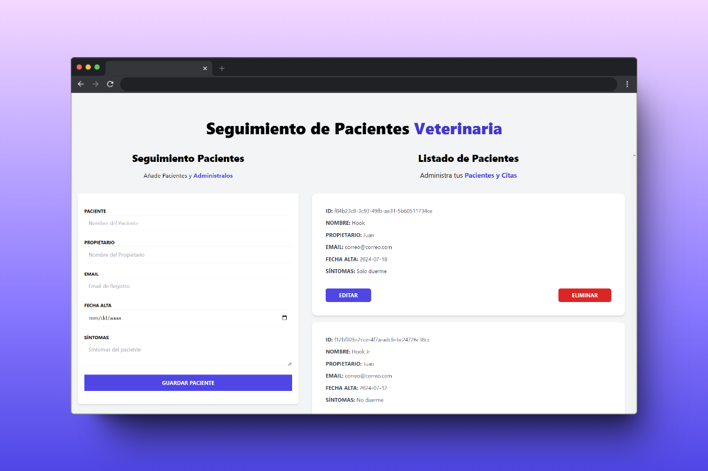
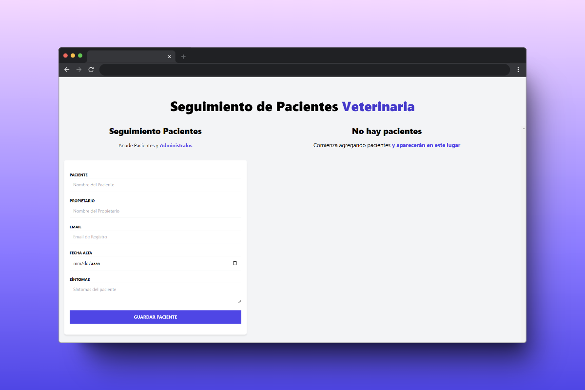

# 🏥 Patient Manager

## 📖 Project Description
Patient Manager is a web application where you can manage your patients. You can add, edit, and delete patients.

## 🎨 Project Features
- **Add Patients:** Easily add new patients to the system with all necessary details.
- **Edit Patients:** Update patient information as needed.
- **Delete Patients:** Remove patients from the system with a simple action.
- **Patient List:** View a list of all patients with their details.
- **Form Validation:** Ensure data integrity with real-time form validation.
- **Notifications:** Get notified of successful or failed operations with toast notifications.

## 🛠️ Technologies Used
 

## 🌐 Libraries Used
- [**zustand**](https://www.npmjs.com/package/zustand)
- [**react-hook-form**](https://www.react-hook-form.com/)
- [**react-toastify**](https://www.npmjs.com/package/react-toastify)

## 📚 What I Learned
I learned how to use Zustand to create a global state. Additionally, I mastered using React Hook Form, a library for form validation and processing, making it incredibly simple.

## 🖼️ Screenshots

## 📬 Contact Information

 
 
 
 